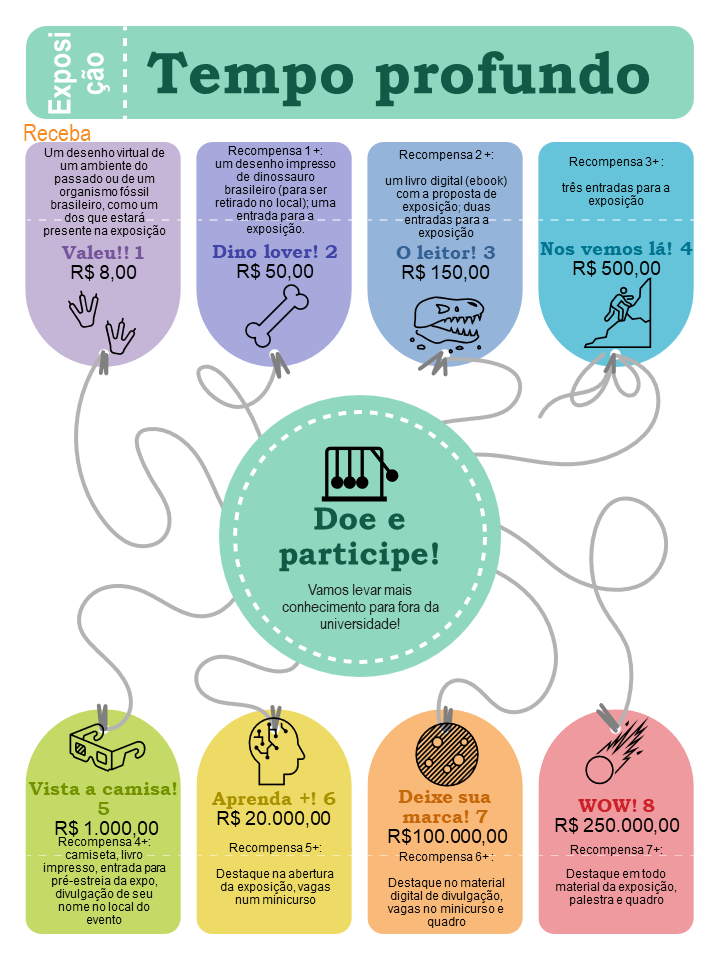

# Objetivo principal
O objetivo deste projeto de crowdfunding é organizar uma exposição científica sobre o tema “Tempo profundo”,  a ser realizada no Instituto Principia, em São Paulo.

# Data
Estamos trabalhando para viabilizar a exposição entre julho e outubro de 2021.

# Sobre a exposição
Pretendemos levar o público a perceber quão grande é a escala do tempo profundo, a conhecer algumas das mudanças que ocorreram na história do planeta e da vida, e de que forma essa vida afeta e é afetada por transformações contínuas e recorrentes, algumas lentas, outras, muito rápidas. 
Com isso os visitantes serão convidados a refletir sobre as mudanças climáticas e as escalas em que estas mudanças ocorrem, observando fósseis, modelos e imagens, interagindo com a exposição.

# Idealizadora
A profa. Dra. Carolina Zabini, paleontóloga e professora pesquisadora do Instituto de Geociências da UNICAMP, é a idealizadora da proposta. Ela e uma equipe formada pelo Museu Exploratório de Ciências da UNICAMP, artistas e pesquisadores, somados à parceria com o Instituto Principia é quem vai organizar a exposição.

# Doações

[Detalhes sobre Doações](doacoes-detalhes.html)

[Doe aqui](doe.html)

# Pesquisa
A exposição também também está sendo elaborada de forma a funcionar como um laboratório para o desenvolvimento de atividades de pesquisa em ensino de geociências no âmbito do programa de pós-graduação em Ensino e História das Ciências da Terra do IG/UNICAMP. 

# Localização
Com a parceria do Instituto Principia, já temos onde expor, e a localização é maravilhosa!
R. Pamplona, 145 - Cerqueira César, São Paulo - SP, 01405-900.